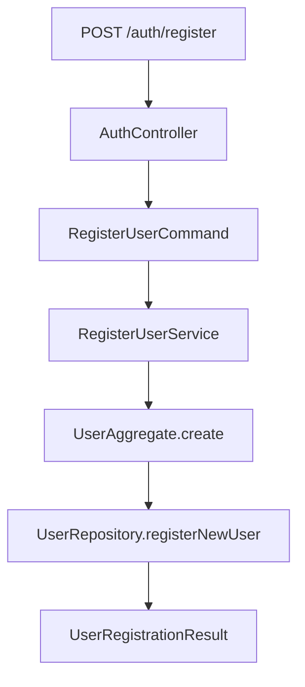
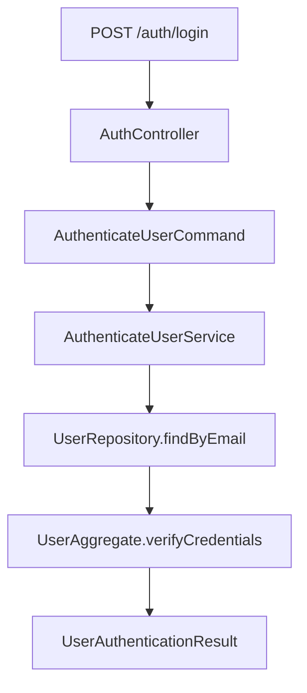
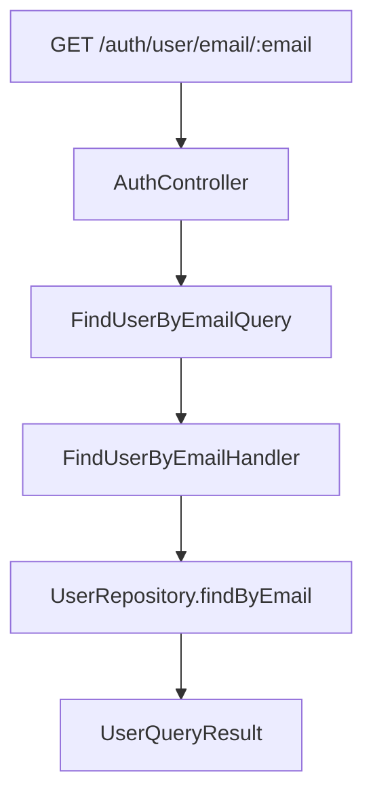

# 🏗️ Proyecto DDD Lite - Autenticación

## 📋 Descripción

Este proyecto demuestra la implementación de **Domain-Driven Design (DDD) Lite** aplicado a un sistema de autenticación con `login` y `register`. Es una versión simplificada que mantiene los conceptos fundamentales de DDD sin la complejidad de los patrones avanzados.

## 🎯 Objetivos de Aprendizaje

Al estudiar este proyecto, aprenderás:

- **Domain-Driven Design (DDD)** en su forma más básica
- **Arquitectura por Capas** (Domain, Application, Infrastructure)
- **Value Objects** básicos con validaciones
- **Agregados** como unidades de consistencia
- **Separación de responsabilidades** entre capas
- **Command Pattern** básico

## 🏛️ Arquitectura del Proyecto

### Estructura de Capas Simplificada

```
src/modules/auth/
├── domain/                    # 🧠 Capa de Dominio (Core Business Logic)
│   ├── aggregates/           # Agregados (UserAggregate)
│   ├── value-objects/        # Value Objects (Email, Password)
│   └── repositories/         # Interfaces de Repositorio
├── application/              # 🔄 Capa de Aplicación (Use Cases)
│   ├── commands/            # Comandos (Register, Login)
│   ├── queries/             # Consultas (FindUser)
│   ├── query-handlers/      # Manejadores de Consultas
│   ├── results/             # Resultados de Operaciones
│   └── services/            # Servicios de Aplicación
└── infrastructure/           # 🔧 Capa de Infraestructura (Technical Details)
    ├── controllers/         # Controladores REST
    ├── dto/                # DTOs de Request/Response
    ├── mappers/            # Mappers de Persistencia
    └── repositories/       # Implementaciones de Repositorio
```

### Principios de Arquitectura

#### 1. **Arquitectura por Capas**

- **Dominio**: Contiene la lógica de negocio pura
- **Aplicación**: Orquesta los casos de uso
- **Infraestructura**: Maneja detalles técnicos

#### 2. **Domain-Driven Design Lite**

- **Agregados**: Unidades de consistencia básicas
- **Value Objects**: Objetos inmutables con validaciones simples
- **Separación de responsabilidades**: Cada capa tiene su propósito específico

## 🧩 Componentes Principales

### 1. **Agregado de Usuario** (`UserAggregate`)

```typescript
export class UserAggregate {
	// Métodos de dominio
	static create(email: string, password: string): UserAggregate;
	static reconstituteFromPersistence(id: string, email: string, password: string): UserAggregate;
	verifyCredentials(candidatePassword: string): boolean;
	getPasswordForPersistence(): string;
}
```

**Características:**

- ✅ **Inmutabilidad**: Una vez creado, no se puede modificar directamente
- ✅ **Validaciones**: Encapsula reglas de negocio del usuario
- ✅ **Consistencia**: Garantiza que el estado siempre sea válido

### 2. **Value Objects Básicos**

#### Email Value Object

```typescript
const email = new Email('user@example.com');
console.log(email.value); // "user@example.com"
```

**Validaciones implementadas:**

- ✅ **Formato básico**: Validación de formato de email
- ✅ **Normalización**: Convierte a minúsculas y elimina espacios

#### Password Value Object

```typescript
const password = new Password('mypassword123');
console.log(password.verifyPassword('mypassword123')); // true
```

**Validaciones implementadas:**

- ✅ **Longitud mínima**: Mínimo 6 caracteres
- ✅ **Verificación**: Método para verificar contraseñas

### 3. **Servicios de Aplicación**

#### Registro de Usuario

```typescript
@Injectable()
export class RegisterUserService {
	async execute(command: RegisterUserCommand): Promise<UserRegistrationResult> {
		// 1. Crear agregado con validaciones
		const userAggregate = UserAggregate.create(command.email, command.password);

		// 2. Verificar unicidad
		const existingUser = await this.userRepository.findUserByEmailAddress(command.email);
		if (existingUser) {
			throw new BadRequestException('Ya existe un usuario registrado con este email');
		}

		// 3. Persistir usuario
		const registeredUser = await this.userRepository.registerNewUser(userAggregate);

		return new UserRegistrationResult(registeredUser.id, registeredUser.emailAddress);
	}
}
```

#### Autenticación de Usuario

```typescript
@Injectable()
export class AuthenticateUserService {
	async execute(command: AuthenticateUserCommand): Promise<UserAuthenticationResult> {
		// 1. Buscar usuario
		const userAggregate = await this.userRepository.findUserByEmailAddress(command.email);
		if (!userAggregate) {
			throw new UnauthorizedException('Las credenciales proporcionadas no son válidas');
		}

		// 2. Verificar credenciales
		if (!userAggregate.verifyCredentials(command.password)) {
			throw new UnauthorizedException('Las credenciales proporcionadas no son válidas');
		}

		return new UserAuthenticationResult(userAggregate.id, userAggregate.emailAddress);
	}
}
```

### 4. **Consultas Básicas**

#### Query Handlers

```typescript
@Injectable()
export class FindUserByEmailHandler {
	async execute(query: FindUserByEmailQuery): Promise<UserQueryResult> {
		const user = await this.userRepository.findUserByEmailAddress(query.email);

		if (!user) {
			throw new NotFoundException(`Usuario no encontrado con el email: ${query.email}`);
		}

		return new UserQueryResult(user.id, user.emailAddress);
	}
}
```

## 🔄 Flujo de Datos Simplificado

### Registro de Usuario



### Login de Usuario



### Consulta de Usuario



## 🚀 Cómo Usar el Proyecto

### Prerrequisitos

- Node.js 18+
- PostgreSQL
- pnpm

### Instalación

```bash
# Instalar dependencias
pnpm install

# Configurar variables de entorno
cp .env.example .env.local

# Iniciar en modo desarrollo
pnpm run dev
```

### Endpoints Disponibles

#### 1. Registro de Usuario

```bash
POST /auth/register
Content-Type: application/json

{
  "email": "usuario@ejemplo.com",
  "password": "mipassword123"
}
```

**Respuesta exitosa:**

```json
{
	"userId": "uuid-del-usuario",
	"email": "usuario@ejemplo.com"
}
```

**Errores posibles:**

- `400 Bad Request`: Email inválido, contraseña débil, usuario ya existe

#### 2. Login de Usuario

```bash
POST /auth/login
Content-Type: application/json

{
  "email": "usuario@ejemplo.com",
  "password": "mipassword123"
}
```

**Respuesta exitosa:**

```json
{
	"userId": "uuid-del-usuario",
	"email": "usuario@ejemplo.com"
}
```

**Errores posibles:**

- `401 Unauthorized`: Credenciales incorrectas
- `400 Bad Request`: Email inválido

#### 3. Consultar Usuario por Email

```bash
GET /auth/user/email/usuario@ejemplo.com
```

**Respuesta:**

```json
{
	"id": "uuid-del-usuario",
	"email": "usuario@ejemplo.com"
}
```

#### 4. Consultar Usuario por ID

```bash
GET /auth/user/uuid-del-usuario
```

**Respuesta:**

```json
{
	"id": "uuid-del-usuario",
	"email": "usuario@ejemplo.com"
}
```

## 📚 Conceptos DDD Lite Implementados

### 1. **Agregados (Aggregates)**

- **UserAggregate**: Unidad de consistencia para usuarios
- **Invariantes**: Garantiza que el estado siempre sea válido
- **Factory Methods**: Métodos estáticos para creación

### 2. **Value Objects**

- **Email**: Objeto inmutable con validaciones básicas
- **Password**: Validaciones de seguridad simples
- **Inmutabilidad**: No se pueden modificar una vez creados

### 3. **Servicios de Aplicación**

- **RegisterUserService**: Orquesta el registro de usuarios
- **AuthenticateUserService**: Maneja la autenticación
- **Separación de responsabilidades**: Cada servicio tiene un propósito específico

### 4. **Arquitectura por Capas**

- **Domain**: Contiene la lógica de negocio pura
- **Application**: Orquesta los casos de uso
- **Infrastructure**: Maneja detalles técnicos

### 5. **Command Pattern**

- **RegisterUserCommand**: Encapsula datos para registro
- **AuthenticateUserCommand**: Encapsula datos para autenticación
- **Queries**: Encapsulan datos para consultas

### 6. **Repository Pattern**

- **UserRepository**: Interface que define contratos
- **TypeOrmUserRepository**: Implementación específica de tecnología
- **Desacoplamiento**: El dominio no depende de la infraestructura

## 🎓 Diferencias con DDD Completo

### ✅ **Lo que SÍ incluye DDD Lite:**

1. **Agregados básicos**: Unidades de consistencia
2. **Value Objects simples**: Con validaciones básicas
3. **Servicios de aplicación**: Orquestación de casos de uso
4. **Separación por capas**: Domain, Application, Infrastructure
5. **Command Pattern**: Encapsulación de datos
6. **Repository Pattern**: Abstracción de persistencia

### ❌ **Lo que NO incluye (vs DDD Completo):**

1. **Eventos de Dominio**: No hay comunicación asíncrona
2. **Políticas de Dominio**: No hay reglas complejas encapsuladas
3. **CQRS avanzado**: No hay separación completa de comandos/consultas
4. **Error Handling expresivo**: Errores HTTP estándar
5. **Event Sourcing**: No hay historial de eventos
6. **Sagas/Process Managers**: No hay orquestación compleja

## 🚀 Cuándo Usar DDD Lite

### ✅ **Ideal para:**

- **Proyectos pequeños a medianos**: Donde DDD completo sería over-engineering
- **Equipos nuevos en DDD**: Como introducción a los conceptos
- **Dominios simples**: Con pocas reglas de negocio complejas
- **Prototipado rápido**: Cuando necesitas estructura pero rapidez

### ⚠️ **No recomendado para:**

- **Dominios muy complejos**: Con muchas reglas de negocio intrincadas
- **Sistemas distribuidos**: Que requieren comunicación asíncrona
- **Equipos grandes**: Donde la coordinación es crítica
- **Long-running processes**: Que requieren orquestación compleja

## 🔧 Comandos Útiles

```bash
# Desarrollo
pnpm run dev              # Iniciar en modo desarrollo
pnpm run build            # Compilar proyecto
pnpm run start            # Iniciar en producción

# Testing
pnpm run test             # Tests unitarios
pnpm run test:watch       # Tests en modo watch
pnpm run test:cov         # Tests con coverage
pnpm run test:e2e         # Tests end-to-end

# Linting
pnpm run lint             # Ejecutar linter
pnpm run format           # Formatear código
```

## 📖 Recursos Adicionales

### Libros Recomendados

- **"Domain-Driven Design"** - Eric Evans (para entender los conceptos completos)
- **"Implementing Domain-Driven Design"** - Vaughn Vernon
- **"Clean Architecture"** - Robert C. Martin

### Artículos

- [Domain-Driven Design Reference](https://domainlanguage.com/ddd/reference/)
- [DDD Lite vs DDD](https://blog.cleancoder.com/uncle-bob/2012/08/13/the-clean-architecture.html)

### Herramientas

- [TypeORM](https://typeorm.io/) - ORM para TypeScript
- [NestJS](https://nestjs.com/) - Framework para Node.js
- [Jest](https://jestjs.io/) - Framework de testing

## 🤝 Contribuir

1. Fork el proyecto
2. Crea una rama para tu feature (`git checkout -b feature/AmazingFeature`)
3. Commit tus cambios (`git commit -m 'Add some AmazingFeature'`)
4. Push a la rama (`git push origin feature/AmazingFeature`)
5. Abre un Pull Request

## 📄 Licencia

Este proyecto está bajo la Licencia MIT - ver el archivo [LICENSE](LICENSE) para detalles.

---

**¡Happy Coding! 🚀**

_Este proyecto es un ejemplo educativo de DDD Lite aplicado. Úsalo como punto de partida para aprender DDD sin la complejidad de los patrones avanzados._
