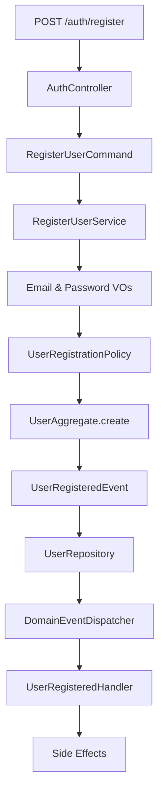
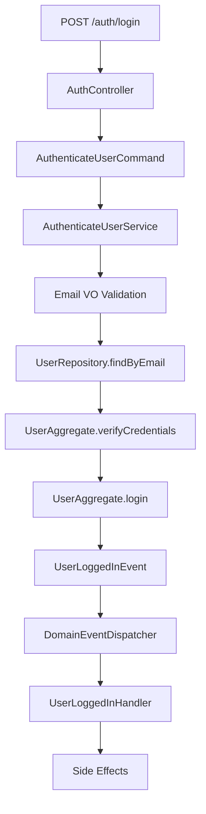
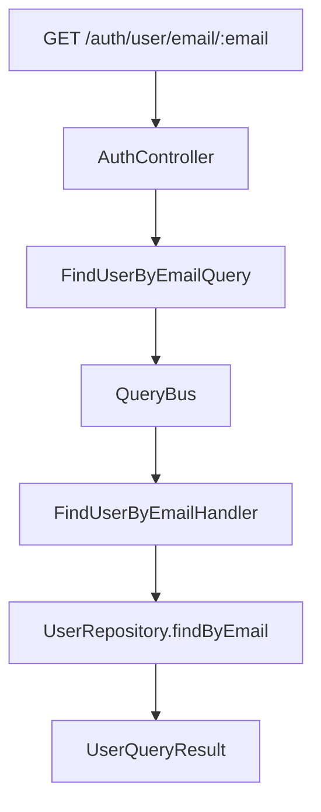

# 🏗️ Proyecto DDD - Autenticación Avanzada

## 📋 Descripción

Este proyecto demuestra la implementación de **Domain-Driven Design (DDD)** aplicado a un sistema de autenticación con `login` y `register`. Aunque las funcionalidades son simples, el proyecto aplica conceptos avanzados de DDD y arquitectura hexagonal para crear un ejemplo didáctico pero robusto.

## 🎯 Objetivos de Aprendizaje

Al estudiar este proyecto, aprenderás:

- **Domain-Driven Design (DDD)** en la práctica
- **Arquitectura Hexagonal** (Ports & Adapters)
- **Eventos de Dominio** y manejo de side-effects
- **Value Objects** ricos con comportamiento
- **Políticas de Dominio** y reglas de negocio
- **CQRS básico** (Command Query Responsibility Segregation)
- **Error Handling** expresivo del dominio
- **Inyección de Dependencias** y desacoplamiento

## 🏛️ Arquitectura del Proyecto

### Estructura de Capas

```
src/modules/auth/
├── domain/                    # 🧠 Capa de Dominio (Core Business Logic)
│   ├── aggregates/           # Agregados (UserAggregate)
│   ├── value-objects/        # Value Objects (Email, Password)
│   ├── events/              # Eventos de Dominio
│   ├── policies/            # Políticas de Dominio
│   ├── errors/              # Errores de Dominio
│   └── repositories/        # Interfaces de Repositorio
├── application/              # 🔄 Capa de Aplicación (Use Cases)
│   ├── commands/            # Comandos (Register, Login)
│   ├── queries/             # Consultas (FindUser)
│   ├── services/            # Servicios de Aplicación
│   ├── event-handlers/      # Manejadores de Eventos
│   ├── query-handlers/      # Manejadores de Consultas
│   └── query-bus/           # Bus de Consultas
└── infrastructure/           # 🔧 Capa de Infraestructura (Technical Details)
    ├── controllers/         # Controladores REST
    ├── repositories/        # Implementaciones de Repositorio
    ├── events/             # Dispatcher de Eventos
    └── mappers/            # Mappers de Persistencia
```

### Principios de Arquitectura

#### 1. **Arquitectura Hexagonal (Ports & Adapters)**

- **Puertos (Interfaces)**: Definen contratos sin implementación
- **Adaptadores**: Implementan los puertos para tecnologías específicas
- **Desacoplamiento**: El dominio no depende de la infraestructura

#### 2. **Domain-Driven Design (DDD)**

- **Agregados**: Unidades de consistencia y transacción
- **Value Objects**: Objetos inmutables con comportamiento
- **Eventos de Dominio**: Comunicación desacoplada entre contextos
- **Políticas**: Reglas de negocio encapsuladas

## 🧩 Componentes Principales

### 1. **Agregado de Usuario** (`UserAggregate`)

```typescript
// Representa la unidad de consistencia para usuarios
export class UserAggregate {
	// Métodos de dominio
	static create(email: string, password: string): UserAggregate;
	verifyCredentials(candidatePassword: string): boolean;
	login(ipAddress?: string, userAgent?: string): void;

	// Gestión de eventos
	getDomainEvents(): DomainEvent[];
	clearDomainEvents(): void;
}
```

**Características:**

- ✅ **Inmutabilidad**: Una vez creado, no se puede modificar directamente
- ✅ **Eventos de Dominio**: Emite eventos cuando ocurren cambios importantes
- ✅ **Validaciones**: Encapsula reglas de negocio del usuario
- ✅ **Consistencia**: Garantiza que el estado siempre sea válido

### 2. **Value Objects Ricos**

#### Email Value Object

```typescript
const email = new Email('user@example.com');
console.log(email.isTemporaryEmail()); // false
console.log(email.isFromKnownProvider()); // true
console.log(email.domain); // "example.com"
```

**Validaciones implementadas:**

- ✅ **Formato RFC**: Cumple con estándares RFC 5321
- ✅ **Longitud**: Máximo 254 caracteres
- ✅ **Caracteres peligrosos**: Previene inyección
- ✅ **Emails temporales**: Detecta servicios como 10minutemail
- ✅ **Proveedores conocidos**: Identifica Gmail, Yahoo, etc.

#### Password Value Object

```typescript
const password = new Password('MyStr0ng!Pass123');
console.log(password.strength); // PasswordStrength.STRONG
console.log(password.isStrongEnough(PasswordStrength.MEDIUM)); // true
```

**Validaciones implementadas:**

- ✅ **Longitud**: Mínimo 8, máximo 128 caracteres
- ✅ **Caracteres requeridos**: Mayúsculas, minúsculas, números
- ✅ **Patrones comunes**: Detecta contraseñas débiles
- ✅ **Análisis de fortaleza**: WEAK, MEDIUM, STRONG, VERY_STRONG

### 3. **Eventos de Dominio**

#### Eventos Implementados

```typescript
// Se emite cuando un usuario se registra
class UserRegisteredEvent {
	constructor(readonly aggregateId: string, readonly email: string, readonly registeredAt: Date) {}
}

// Se emite cuando un usuario inicia sesión
class UserLoggedInEvent {
	constructor(
		readonly aggregateId: string,
		readonly email: string,
		readonly loginAt: Date,
		readonly ipAddress?: string,
		readonly userAgent?: string
	) {}
}
```

#### Event Handlers

```typescript
@Injectable()
export class UserRegisteredHandler {
	async handle(event: UserRegisteredEvent): Promise<void> {
		// Side-effects del registro
		await this.sendWelcomeEmail(event.email);
		await this.createUserProfile(event.aggregateId);
		await this.trackUserRegistration(event);
	}
}
```

**Beneficios:**

- ✅ **Desacoplamiento**: Los side-effects no afectan la lógica principal
- ✅ **Escalabilidad**: Fácil agregar nuevos handlers
- ✅ **Auditabilidad**: Registro completo de eventos
- ✅ **Integración**: Comunicación con otros sistemas

### 4. **Políticas de Dominio**

```typescript
// Política estándar
export class StandardUserRegistrationPolicy {
	validateRegistrationContext(email: Email, password: Password): void {
		this.validateEmail(email); // No emails temporales
		this.validatePassword(password); // Fortaleza MEDIUM
		this.validateNoEmailInPassword(password, email); // Seguridad
	}
}

// Política estricta
export class StrictUserRegistrationPolicy {
	validateRegistrationContext(email: Email, password: Password): void {
		this.validateEmail(email); // Solo proveedores conocidos
		this.validatePassword(password); // Fortaleza STRONG
		this.validateNoEmailInPassword(password, email);
		this.validateMinLength(password, 12); // Mínimo 12 caracteres
	}
}
```

**Características:**

- ✅ **Configurabilidad**: Diferentes políticas según contexto
- ✅ **Reutilización**: Misma interfaz, diferentes implementaciones
- ✅ **Testabilidad**: Fácil de probar independientemente
- ✅ **Mantenibilidad**: Cambios de política sin afectar lógica

### 5. **CQRS Básico**

#### Separación de Comandos y Consultas

**Comandos** (Modifican estado):

```typescript
// Registro de usuario
class RegisterUserCommand {
	constructor(public readonly email: string, public readonly password: string) {}
}

// Autenticación de usuario
class AuthenticateUserCommand {
	constructor(public readonly email: string, public readonly password: string) {}
}
```

**Consultas** (Solo leen):

```typescript
// Buscar usuario por email
class FindUserByEmailQuery {
	constructor(public readonly email: string) {}
}

// Buscar usuario por ID
class FindUserByIdQuery {
	constructor(public readonly userId: string) {}
}
```

#### Query Bus

```typescript
@Injectable()
export class QueryBusService {
	async execute<T>(query: any): Promise<T> {
		if (query instanceof FindUserByEmailQuery) {
			return this.findUserByEmailHandler.execute(query);
		}
		if (query instanceof FindUserByIdQuery) {
			return this.findUserByIdHandler.execute(query);
		}
		throw new Error(`No handler found for query: ${query.constructor.name}`);
	}
}
```

**Beneficios:**

- ✅ **Separación clara**: Comandos vs Consultas
- ✅ **Optimización**: Consultas optimizadas independientemente
- ✅ **Escalabilidad**: Fácil agregar nuevas consultas
- ✅ **Mantenibilidad**: Lógica separada y enfocada

### 6. **Error Handling Expresivo**

```typescript
// Errores específicos del dominio
export class InvalidEmailError extends Error {
	constructor(email: string, reason?: string) {
		const message = reason ? `Email inválido: ${email}. Razón: ${reason}` : `Email inválido: ${email}`;
		super(message);
		this.name = 'InvalidEmailError';
	}
}

export class WeakPasswordError extends Error {
	constructor(reason: string) {
		super(`Contraseña débil: ${reason}`);
		this.name = 'WeakPasswordError';
	}
}

export class UserAlreadyExistsError extends Error {
	constructor(email: string) {
		super(`Ya existe un usuario registrado con el email: ${email}`);
		this.name = 'UserAlreadyExistsError';
	}
}
```

**Características:**

- ✅ **Específicos**: Cada error tiene su propio tipo
- ✅ **Contexto rico**: Información detallada sobre la causa
- ✅ **Mapeo HTTP**: Conversión automática a códigos HTTP
- ✅ **Mantenibilidad**: Fácil identificar y manejar errores

## 🔄 Flujo de Datos

### Registro de Usuario



### Login de Usuario



### Consulta de Usuario



## 🚀 Cómo Usar el Proyecto

### Prerrequisitos

- Node.js 18+
- PostgreSQL
- pnpm

### Instalación

```bash
# Instalar dependencias
pnpm install

# Configurar variables de entorno
cp .env.example .env.local

# Ejecutar migraciones
pnpm run migration:run

# Iniciar en modo desarrollo
pnpm run dev
```

### Endpoints Disponibles

#### 1. Registro de Usuario

```bash
POST /auth/register
Content-Type: application/json

{
  "email": "usuario@ejemplo.com",
  "password": "MiContraseña123!"
}
```

**Respuesta exitosa:**

```json
{
	"userId": "uuid-del-usuario",
	"email": "usuario@ejemplo.com"
}
```

**Errores posibles:**

- `400 Bad Request`: Email inválido, contraseña débil, usuario ya existe
- `400 Bad Request`: Email temporal no permitido

#### 2. Login de Usuario

```bash
POST /auth/login
Content-Type: application/json

{
  "email": "usuario@ejemplo.com",
  "password": "MiContraseña123!"
}
```

**Respuesta exitosa:**

```json
{
	"userId": "uuid-del-usuario",
	"email": "usuario@ejemplo.com"
}
```

**Errores posibles:**

- `401 Unauthorized`: Credenciales incorrectas
- `400 Bad Request`: Email inválido

#### 3. Consultar Usuario por Email

```bash
GET /auth/user/email/usuario@ejemplo.com
```

**Respuesta:**

```json
{
	"id": "uuid-del-usuario",
	"email": "usuario@ejemplo.com"
}
```

> **Nota**: El campo `createdAt` se genera dinámicamente ya que no está almacenado en la base de datos.

#### 4. Consultar Usuario por ID

```bash
GET /auth/user/uuid-del-usuario
```

**Respuesta:**

```json
{
	"id": "uuid-del-usuario",
	"email": "usuario@ejemplo.com"
}
```

> **Nota**: El campo `createdAt` se genera dinámicamente ya que no está almacenado en la base de datos.

## 🧪 Testing

### Ejecutar Tests

```bash
# Tests unitarios
pnpm run test

# Tests con coverage
pnpm run test:cov

# Tests e2e
pnpm run test:e2e
```

### Ejemplos de Tests

#### Test de Value Object

```typescript
describe('Email Value Object', () => {
	it('should create valid email', () => {
		const email = new Email('user@example.com');
		expect(email.value).toBe('user@example.com');
		expect(email.domain).toBe('example.com');
	});

	it('should reject invalid email', () => {
		expect(() => new Email('invalid-email')).toThrow(InvalidEmailError);
	});

	it('should detect temporary emails', () => {
		const email = new Email('test@10minutemail.com');
		expect(email.isTemporaryEmail()).toBe(true);
	});
});
```

## 📚 Conceptos DDD Implementados

### 1. **Agregados (Aggregates)**

- **UserAggregate**: Unidad de consistencia para usuarios
- **Invariantes**: Garantiza que el estado siempre sea válido
- **Eventos**: Emite eventos cuando ocurren cambios importantes

### 2. **Value Objects**

- **Email**: Objeto inmutable con validaciones y comportamiento
- **Password**: Análisis de fortaleza y validaciones de seguridad
- **Inmutabilidad**: No se pueden modificar una vez creados

### 3. **Eventos de Dominio**

- **UserRegisteredEvent**: Se emite al registrar un usuario
- **UserLoggedInEvent**: Se emite al hacer login
- **Handlers**: Procesan side-effects de manera desacoplada

### 4. **Políticas de Dominio**

- **UserRegistrationPolicy**: Encapsula reglas de negocio
- **Configurabilidad**: Diferentes políticas según contexto
- **Reutilización**: Misma interfaz, diferentes implementaciones

### 5. **CQRS Básico**

- **Comandos**: Modifican el estado del sistema
- **Consultas**: Solo leen información
- **Separación**: Lógica independiente para cada responsabilidad

### 6. **Arquitectura Hexagonal**

- **Puertos**: Interfaces que definen contratos
- **Adaptadores**: Implementaciones específicas de tecnología
- **Desacoplamiento**: El dominio no depende de la infraestructura

### 7. **Error Handling**

- **Errores específicos**: Cada tipo de error tiene su clase
- **Contexto rico**: Información detallada sobre la causa
- **Mapeo HTTP**: Conversión automática a códigos de respuesta

### 8. **Inyección de Dependencias**

- **Desacoplamiento**: Dependencias inyectadas, no instanciadas
- **Testabilidad**: Fácil mockear dependencias en tests
- **Configurabilidad**: Diferentes implementaciones según contexto

## 🎓 Lecciones Aprendidas

### ✅ **Beneficios de DDD**

1. **Código expresivo**: El código refleja el lenguaje del negocio
2. **Mantenibilidad**: Cambios localizados y predecibles
3. **Testabilidad**: Componentes independientes y fáciles de probar
4. **Escalabilidad**: Arquitectura preparada para crecer

### ⚠️ **Consideraciones**

1. **Complejidad inicial**: Más código para casos simples
2. **Curva de aprendizaje**: Requiere entender conceptos DDD
3. **Over-engineering**: No siempre necesario para proyectos pequeños

### 🚀 **Cuándo Usar DDD**

- ✅ **Dominio complejo**: Reglas de negocio complejas
- ✅ **Equipo grande**: Múltiples desarrolladores
- ✅ **Largo plazo**: Proyectos que evolucionan
- ✅ **Integración**: Múltiples sistemas

## 🔧 Comandos Útiles

```bash
# Desarrollo
pnpm run dev              # Iniciar en modo desarrollo
pnpm run build            # Compilar proyecto
pnpm run start            # Iniciar en producción

# Testing
pnpm run test             # Tests unitarios
pnpm run test:watch       # Tests en modo watch
pnpm run test:cov         # Tests con coverage
pnpm run test:e2e         # Tests end-to-end

# Linting
pnpm run lint             # Ejecutar linter
pnpm run format           # Formatear código

# Base de datos
pnpm run migration:generate --name=MigrationName
pnpm run migration:run
pnpm run migration:revert
```

## 📖 Recursos Adicionales

### Libros Recomendados

- **"Domain-Driven Design"** - Eric Evans
- **"Implementing Domain-Driven Design"** - Vaughn Vernon
- **"Clean Architecture"** - Robert C. Martin

### Artículos

- [Domain-Driven Design Reference](https://domainlanguage.com/ddd/reference/)
- [Hexagonal Architecture](https://alistair.cockburn.us/hexagonal-architecture/)
- [CQRS Pattern](https://docs.microsoft.com/en-us/azure/architecture/patterns/cqrs)

### Herramientas

- [TypeORM](https://typeorm.io/) - ORM para TypeScript
- [NestJS](https://nestjs.com/) - Framework para Node.js
- [Jest](https://jestjs.io/) - Framework de testing

**¡Happy Coding! 🚀**

_Codea simple Codea bien_
